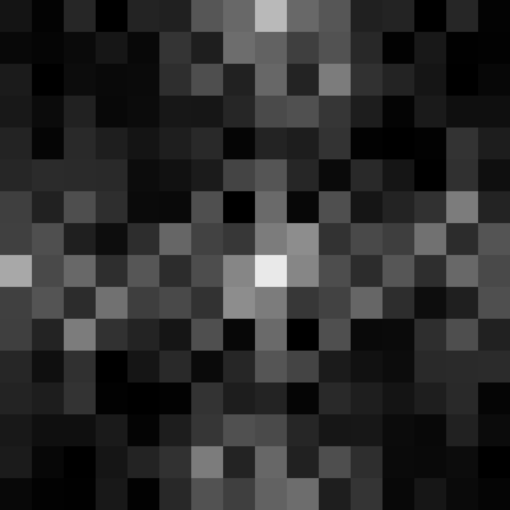

Experiments with plane-filling curves and Fourier transform
===========================================================

A set of visual experiments: applying Fourier transform to various plane-filling curves.


Running
-------

To generate images, run:
```` sh
$ python fft_experiments.py
````
Or just
```` sh
$ make
````

To change parameters, edit the file fft_experiments.py.


Requirements
------------

Python 3, pillow, numpy.


Tests
-----
Some tests are present. Run
```` sh
$ make test
````
to execute them.


# Scaling the recursion depth

## Hilbert Curve

Depth  | FFT
-------|--------------
0      | 
1      | 
2      | 
3      | 
4      | 
5      | 
6      | 
7      | 
8      | 
9      | 
10     | 
11     | 
12     | 
13     | 

## Hilbert Pattern

Depth  | FFT
-------|--------------
0      | 
1      | 
2      | 
3      | 
4      | 
5      | 
6      | 
7      | 
8      | 
9      | 
10     | 
11     | 
12     | 
13     | 

## Dragon Curve

Depth  | FFT
-------|--------------
0      | 
1      | 
2      | 
3      | 
4      | 
5      | 
6      | 
7      | 
8      | 
9      | 
10     | 
11     | 
12     | 
13     | 

## Gosper Diagram

Depth  | FFT
-------|--------------
0      | 
1      | 
2      | 
3      | 
4      | 
5      | 
6      | 
7      | 
8      | 
9      | 
10     | 
11     | 
12     | 
13     | 
